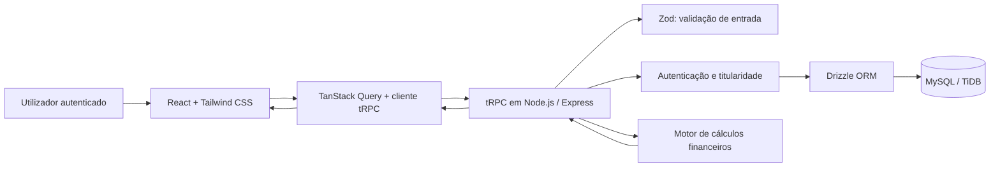

# Relatório técnico de construção do website

## Liga Rural — M.V.P. de gestão financeira rural

**Data do relatório:** 19 de agosto de 2026  
**Versão documentada:** `904438c4`  
**Ambiente publicado:** [ligarural-kqybprrn.manus.space](https://ligarural-kqybprrn.manus.space)

## 1. Enquadramento

O **Liga Rural** foi construído como um *Minimum Viable Product* para apoiar a gestão financeira de propriedades rurais. O foco do desenvolvimento foi entregar uma experiência web utilizável e segura para definir o perfil do utilizador, cadastrar uma ou mais propriedades, registar movimentações financeiras e consultar os principais resultados económicos por período.

O recorte funcional implementado corresponde aos requisitos prioritários de cadastro de utilizadores e propriedades, registo de receitas, cálculo do fluxo de caixa, consulta temporal, lucro bruto, lucro líquido e painel financeiro. Para tornar os indicadores financeiramente coerentes, o M.V.P. também suporta custos de produção, despesas administrativas, impostos e deduções.

> O objetivo do M.V.P. não é substituir análise contabilística, económica ou consultoria rural especializada. Ele organiza os lançamentos e apresenta cálculos transparentes a partir dos dados registados.

## 2. Tecnologias, linguagens e ferramentas utilizadas

O website foi desenvolvido como uma aplicação *full-stack* tipada. A tabela seguinte apresenta a stack adotada e o papel de cada tecnologia no processo.

| Camada | Linguagem ou tecnologia | Papel na solução |
|---|---|---|
| Linguagem principal | **TypeScript** | Tipagem estática no cliente, servidor, regras de cálculo e testes. |
| Frontend | **React 19** | Construção das páginas, componentes reutilizáveis e estados de interface. |
| Construção do frontend | **Vite 7** | Servidor de desenvolvimento e criação do pacote otimizado para produção. |
| Estilos | **Tailwind CSS 4** | Composição responsiva da interface, gradientes, tipografia, espaçamento e estados visuais. |
| Componentes de interface | **Radix UI / shadcn-ui** | Base acessível para diálogos, seletores, formulários, tabelas, menus e componentes de navegação. |
| Navegação | **Wouter** | Rotas de visão geral, propriedades, fluxo de caixa e perfil. |
| Ícones | **Lucide React** | Iconografia consistente para finanças, propriedades e ações. |
| Estado remoto | **TanStack Query** | Cache, invalidação e atualização dos dados obtidos pela API. |
| API tipada | **tRPC 11** | Comunicação cliente-servidor com contratos TypeScript de ponta a ponta. |
| Backend | **Node.js + Express 4** | Servidor da aplicação e suporte à API tRPC. |
| Validação | **Zod 4** | Validação e normalização dos dados recebidos nas rotas de perfil, propriedades e lançamentos. |
| Banco de dados | **MySQL/TiDB** | Persistência de utilizadores, perfis, propriedades e movimentos financeiros. |
| ORM e migrações | **Drizzle ORM + Drizzle Kit** | Modelação tipada do banco, geração e aplicação da migração SQL. |
| Serialização | **SuperJSON** | Transporte seguro de tipos como `Date` entre o backend e o frontend. |
| Testes | **Vitest** | Testes das fórmulas, filtros temporais, sessão, autorização e fluxo de uso controlado. |
| Empacotamento do servidor | **esbuild** | Geração do artefacto de produção do backend. |
| Gestor de pacotes | **pnpm** | Instalação de dependências e execução dos comandos do projeto. |

As dependências e os comandos de desenvolvimento, validação, testes e compilação estão definidos no ficheiro `package.json`. [1]

## 3. Processo de construção

O desenvolvimento seguiu uma sequência incremental, partindo da análise do documento de requisitos para uma implementação de escopo controlado. Primeiro foram identificadas as regras funcionais prioritárias e as regras de negócio que influenciavam os cálculos. Em seguida, o projeto foi inicializado com recursos de autenticação, servidor e banco de dados, evitando a criação de uma aplicação apenas demonstrativa ou dependente de dados estáticos.

Na etapa de modelação, foram definidos os dados mínimos necessários para não misturar resultados entre propriedades e para manter a precisão financeira. Depois de atualizado o esquema, a migração SQL foi gerada, revista e aplicada ao banco de dados. A camada de API foi implementada antes das páginas, permitindo que a interface consumisse operações tipadas para perfis, propriedades, lançamentos e resumo financeiro.

Por fim, foi construída a interface com uma navegação lateral para o ambiente de gestão e com páginas responsivas. O design foi submetido a verificação visual em ambiente de computador e telemóvel, sem inserir dados fictícios na conta do utilizador. Os cálculos e os fluxos críticos foram igualmente validados por testes automatizados.

| Fase | Atividades executadas | Resultado |
|---|---|---|
| Análise | Leitura dos requisitos e definição do recorte do M.V.P. | Escopo concentrado nas regras financeiras prioritárias. |
| Estrutura | Inicialização do projeto web *full-stack*. | Frontend, servidor, autenticação e banco disponíveis. |
| Dados | Modelação, geração e aplicação da migração. | Tabelas para perfis, propriedades e lançamentos. |
| API | Rotas tRPC, validação Zod, controlo de titularidade e fórmulas. | Operações protegidas e tipadas. |
| Interface | Páginas, navegação, formulários, tabelas, indicadores e estados vazios. | Experiência completa para o primeiro uso. |
| Qualidade | Testes, verificação de tipos, compilação e verificação visual. | Versão registada e pronta para evolução. |

## 4. Arquitetura da aplicação

A solução segue uma arquitetura em camadas. O React compõe a interface e invoca os procedimentos tRPC. O servidor valida a sessão, recebe a operação, aplica as regras de autorização e negócio e consulta o banco por intermédio do Drizzle ORM. O retorno tipado regressa ao frontend para atualização dos componentes.

O uso de tRPC reduz a duplicação de contratos entre a interface e o servidor: os tipos inferidos no backend são reutilizados nas chamadas do frontend. As rotas financeiras são protegidas por `protectedProcedure`; além de exigir sessão autenticada, a consulta de lançamentos e do painel verifica se a propriedade pertence ao utilizador atual. [2]

## 5. Modelação de dados

O modelo foi desenhado para que cada lançamento esteja associado a uma única propriedade, e cada propriedade possua um titular. Os valores monetários usam `decimal(14,2)`, preservando duas casas decimais e evitando a imprecisão típica de números binários de ponto flutuante no armazenamento.

| Entidade | Campos relevantes | Finalidade |
|---|---|---|
| `users` | `id`, `openId`, nome, e-mail, método de login, função técnica | Registo base de autenticação providenciado pela plataforma. |
| `userProfiles` | `userId`, `profileRole` | Perfil de utilização: produtor, gestor, estudante, consultor ou administrador. |
| `ruralProperties` | `ownerId`, nome, município, UF, área, atividade, estado ativo | Representação da propriedade rural e respetiva titularidade. |
| `financialEntries` | `propertyId`, `createdById`, tipo, categoria, descrição, data, valor | Movimentações que alimentam o fluxo de caixa e os resultados. |

Foram criados índices para a consulta de propriedades por titular e para lançamentos por propriedade e data. Esta decisão melhora as consultas mais frequentes do M.V.P.: carregar as propriedades de um utilizador e consultar o fluxo de caixa de uma propriedade em determinado período. [3]

## 6. Regras de negócio e cálculos

Os lançamentos aceitam cinco classificações: receita, custo de produção, despesa administrativa, imposto e dedução. No registo, o valor tem de ser positivo, a data é validada no formato `AAAA-MM-DD`, e os campos de categoria e descrição têm limites mínimos e máximos. A validação é executada no servidor e não apenas na interface. [2]

| Indicador | Fórmula aplicada | Finalidade |
|---|---|---|
| Receita total | Soma dos lançamentos do tipo `receita` | Medir as entradas da propriedade. |
| Custos de produção | Soma de `custo_producao` | Identificar custos diretamente ligados à produção. |
| Lucro bruto | Receita total − custos de produção | Avaliar o resultado antes das despesas gerais. |
| Lucro líquido | Receita − custos − despesas administrativas − impostos − deduções | Medir o resultado final do período. |
| Saldo do fluxo de caixa | Mesma composição do lucro líquido no recorte atual | Mostrar o saldo financeiro acumulado dos movimentos registados. |

O motor de cálculo descarta valores inválidos ou negativos antes da agregação e arredonda os resultados para duas casas decimais. O filtro temporal calcula janelas para dia, mês, trimestre ou ano, a partir de uma data de referência. [4]

## 7. Interface e direção visual

O produto foi desenhado como um painel de operação financeira, e não como um site institucional. A navegação lateral conduz às quatro áreas principais: **Visão geral**, **Propriedades**, **Fluxo de caixa** e **Meu perfil**.

A direção visual solicitada foi materializada com fundo escuro em gradiente de teal profundo e laranja queimado, texto branco com contraste elevado, componentes semitransparentes, sombras amplas e detalhes geométricos de baixa intensidade. O ciano foi reservado para ações primárias e sinais de inteligência financeira; o laranja foi utilizado em ações de cadastro e contextos de destaque.

| Ecrã | Responsabilidade de uso |
|---|---|
| Visão geral | Seleciona propriedade e período; apresenta saldo, lucro bruto, lucro líquido e composição do resultado. |
| Propriedades | Cria e seleciona propriedades vinculadas ao utilizador. |
| Fluxo de caixa | Cria lançamentos e lista movimentos por período, exibindo entradas, saídas e saldo. |
| Meu perfil | Define e atualiza o perfil profissional de utilização. |

Foram implementados estados de carregamento, estados vazios e mensagens de erro com ação de nova tentativa. A interface adapta a navegação, espaçamentos e blocos de conteúdo para ecrãs móveis, mantendo o acesso por teclado e anéis de foco visíveis nos elementos interativos.

## 8. Autenticação, validação e segurança

A autenticação utiliza a infraestrutura OAuth disponibilizada pelo ambiente do projeto. Assim, o M.V.P. não armazena nem processa palavras-passe próprias. Quando uma procedure protegida é chamada sem uma sessão válida, a operação é bloqueada antes do acesso ao banco.

Além da autenticação, a aplicação aplica autorização por titularidade. Antes de listar lançamentos, criar um lançamento ou calcular o resumo, o backend consulta a propriedade com o identificador do utilizador autenticado. Caso a propriedade não seja encontrada para esse titular, a API devolve `FORBIDDEN` e não executa a consulta financeira. [2]

| Controlo | Implementação |
|---|---|
| Sessão autenticada | `protectedProcedure` para rotas de perfil, propriedades, lançamentos e painel. |
| Titularidade | Verificação de `ownerId` antes de operações financeiras. |
| Validação de entrada | Esquemas Zod para textos, números, datas, tipos de lançamento e períodos. |
| Precisão financeira | Persistência decimal com duas casas e arredondamento no resumo. |
| Erros de interface | Estados visuais de carregamento, falha e nova tentativa. |

## 9. Testes e validação de qualidade

A versão final foi validada com os comandos `pnpm test`, `pnpm check` e `pnpm build`. O resultado foi uma execução bem-sucedida de **11 testes distribuídos por quatro ficheiros**, verificação TypeScript sem erros e compilação de produção concluída.

| Área validada | Cobertura realizada |
|---|---|
| Sessão | Teste de encerramento de sessão e limpeza de *cookie*. |
| Cálculos | Receita, custos, impostos, deduções, saldo, lucro bruto e lucro líquido. |
| Períodos | Limites de dia, mês, trimestre e ano, incluindo data inválida. |
| Autorização | Bloqueio de utilizadores não autenticados e de propriedades sem titularidade. |
| Fluxo controlado | Perfil, criação de propriedade, lançamento e consulta mensal com banco simulado. |
| Interface | Capturas de ecrã em computador e telemóvel para as principais páginas e estados iniciais. |

O processo de compilação apresentou apenas um aviso de otimização: o pacote JavaScript principal excede o limite de referência de 500 kB após minificação. Não bloqueia o funcionamento da aplicação, mas recomenda-se a divisão de código por rota numa evolução futura, de forma a reduzir o carregamento inicial.

## 10. Limites do M.V.P. e evolução recomendada

O produto entregue cobre o núcleo financeiro definido para o primeiro incremento, mas não inclui ainda todo o conjunto de requisitos do documento original. Funcionalidades como edição e exclusão de lançamentos, gestão de permissões colaborativas por propriedade, balanço patrimonial, indicadores produtivos, gráficos analíticos, exportação em PDF ou planilha, importação de dados e simulações de investimento permanecem fora do escopo atual.

Também não foi implementado um fluxo próprio de cadastro com e-mail e palavra-passe, pois a autenticação é providenciada pela infraestrutura OAuth do ambiente. Se o produto passar a ser utilizado fora deste ambiente, será necessário avaliar um provedor de identidade próprio, bem como políticas de LGPD, cópias de segurança, auditoria e recuperação de conta.

| Prioridade sugerida | Próxima evolução | Impacto esperado |
|---|---|---|
| Alta | Edição e exclusão de propriedades e lançamentos | Corrige dados lançados incorretamente. |
| Alta | Permissões para gestor e consultor por propriedade | Permite colaboração segura entre perfis. |
| Média | Gráficos e relatórios exportáveis | Facilita a análise e a apresentação de resultados. |
| Média | Indicadores produtivos e patrimoniais | Amplia o diagnóstico para além do fluxo financeiro. |
| Técnica | Divisão de código por rota | Reduz o tamanho do carregamento inicial. |

## 11. Conclusão

O website Liga Rural foi construído como uma aplicação web *full-stack* moderna, tipada e orientada ao domínio de gestão financeira rural. A combinação de TypeScript, React, tRPC, Drizzle ORM e MySQL/TiDB permitiu criar um fluxo consistente desde a introdução de um dado até à apresentação do respetivo impacto financeiro no painel.

O resultado é uma base funcional para evolução académica ou de produto. O sistema já preserva a separação entre propriedades, aplica validações, protege operações financeiras por autenticação e titularidade e mantém as fórmulas de resultado centralizadas e testadas.

## Referências técnicas internas

[1] [Dependências e comandos do projeto](../package.json)  
[2] [Rotas financeiras, validações e autorização](../server/routers/finance.ts)  
[3] [Esquema de banco de dados](../drizzle/schema.ts)  
[4] [Motor de cálculos e filtros temporais](../shared/financial.ts)  
[5] [Configuração dos testes](../vitest.config.ts)
